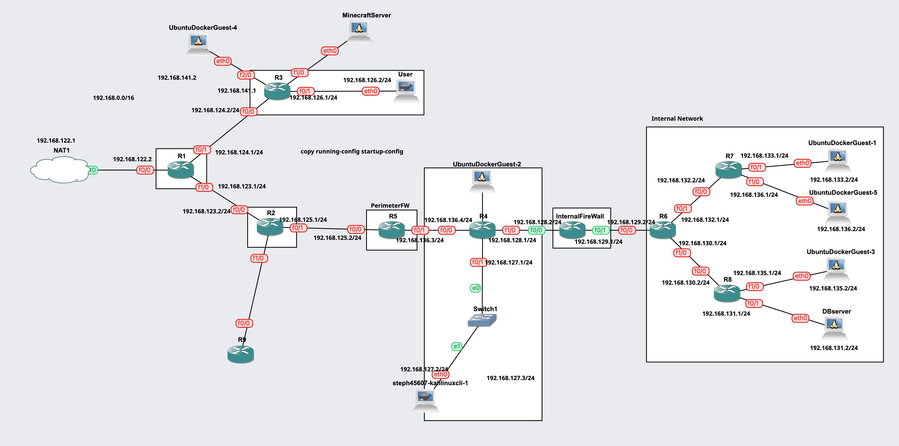

# Vulnerable Infrastructure with GNS3 🎯🔓💻🔗🚫

## Tools


## How to Install/Run
1. Download GNS3
2. Import all appliances needed
   1. C375 routers
   2. Ubuntu Docker Guest
   3. Kali Linux CLI
3. Import `DMZ.gns3project` to GNS3
   
```
Note: the DMZ.gns3project is just a name, does not represent the DMZ only, but it's the whole topology.
```
## Layers of Topology
1. Perimeter Firewall
    - The perimeter firewall is a Cisco router that has several access list commands declared, making it only accept several ports that have been explicitly accepted. It is then connected to the main topology of the infrastructure, leading to the Web Application layer if penetrated.
    - We declare the acceptable and non-acceptable ports with the following commands:
    ````
    config t
    ````
    ````
    access-list <access_list_number> <permit|deny> <protocol> <source> <source_mask> <destination> <destination_mask> eq <port>
    ````
    - These are the following ports that are declared</br>
     </br>
    It accepts IP and ICMP. It accepts also port 80 (www/HTTP), 443 (HTTPS), 25565 (Minecraft Server), 20 & 21 (FTP), 22 (SSH), 53 (DNS) for TCP and UDP. Then it will deny all other TCP and UDP traffic from any undeclared permittable ports.
<br></br>
2. DMZ
    - The DMZ consist of a Cisco c3745 router, an ethernet switch, and a KaliLinux machine. A user that is connected to the internet should be able to ping the KaliLinux machine and access the web app hosted inside the machine.
    - The web app inside the KaliLinux machine is a textbox with a submit button that connects to our database in the internal network.
    - The topology of DMZ looks like this <br> </br>
3. Internal Firewall
    - The internal firewall consist of a cisco router, connecting DMZ and internal network, utilizing access list commands to regulate open ports. Declared ports are as follow:
   </br>
5. Internal Network
    - The topology is made of 3 cisco c3745 routers and 4 Kali Linux machine that serves as host for the different servers that are implemented. This set up makes sure that resources are shared efficiently as some servers actually require the same ones. 
    - The first router R6 serves as a bridge between the other components of the network and the internal network, it redirects incoming requests to the right subnet and redirect outgoing ones to the internet.
    - The two other routers are used to put the servers in different subnets in order to allow efficient allocation of resources. R8 is linked to the database and web servers which supposedly communicate with each other a lot, the other router R7 is linked with the FTP servers and another machine representing one that would communicate with all the servers.
    - The kali linux machines are used as servers and trial machine, there is the database machine using the mysql server, the web server based on apache and the ftp server as well. The last machine is used to test out if the different servers work perfectly all through the network.
    - The topology of the internal network looks like this  <br> </br>
   
## Vulnerabilities

1. Perimeter Firewall
- Below are listed the vulnerabilities and the prevention of the vulnerabilities of the Perimeter Firewall:</br>
 </br>

2. DMZ
- The Kali Linux CLI is running `python2 -m SimpleHTTPServer 80` with no protection at all, just a simple HTTP website.
   - <br>  </br>
   To counter the no protection, we should incorporate security measures such as filter input on arrival, encode data on output, use appropriate response headers, integrate content security policy (CSP), and remove unwanted data
3. Internal Firewall
   - Distributed Denial of Service (DDOS) attack, disrupting the network overwhelming it with a flood of internet traffic, usage of request control is a technique used to control the rate or frequency of incoming requests to a server or service. It can be an effective strategy for mitigating DDOS attacks
   - Lack of deep packet inspection (DPI) refers to a situation where a network or security system does not have the capability to inspect the content of network packets beyond the basic header information. By inspecting packet contents, DPI can identify and analyze specific data patterns, signatures, or anomalies, enabling a deeper understanding of network activity
   - SSH with weak password, using a weak password for SSH authentication poses a significant security risk as it can make your system vulnerable to unauthorized access and potential attacks. To mitigate this risk, it is crucial to use strong passwords for SSH authentication.
4. Internal Network
   - FTP
       - The FTP server can accept new user with weak password for file transferring.
       - The file that are being transferred are not encrypted
   - Web server
       - all the web app vulnerabilities can be related to the web server because it can be accesses through a browser: xss, DoS, sql injection,...
       - open ssh: could be considered a vulnerability even though it is not really, it becomes depending on its security
   - Database server
       - weak password and username
       - open for ssh: could be considered a vulnerability even though it is not really, it becomes depending on its security

## Limitations
1. Perimeter Firewall<br>
   There are a few errors in the perimeter firewall such as the perimeter firewall being unable to connect users outside the firewall to the server (unable to act as a router) since there's also an error in router R2 and time limitation due to the changes that we made in the last moment (Change the perimeter firewall from Kali Linux CLI to a Cisco router).  Besides that, the perimeter firewall also may block ports that we have enabled or is unable to fulfill successful port forwarding. We haven't been able to figure out the reason for this problem due to the time limitations that we have. The vulnerabilities listed are also not fully tested due to time constraints</br>
2. DMZ<br>
   The KaliLinux machine in the DMZ cannot be accessed by users in the internet as R2 and the perimeter firewall is blocking the transmit. The machine also cannot connect to the internal network as the internal firewall is blocking the connection. The DMZ isn't doing what it is supposed to do as the connections from outside the network and inside the network is blocked. It truly is no man's land.
3. Internal Firewall<br>
   The current limitations and flaws of the Internal Firewall is that it performs port filtering, however the Internal firewall that was built using a router failed on acting as a router. Therefore as of now connection cannot make it through. This limitation has not been solved due to the time limitation that we have.</br>
4. Internal Network
   The current limitation for the internal network is the FTP server cannot receive file from machines outside the internal network. Each time a machine outside the internal network tries to connect to the FTP server, it gives connection time out error.
   We did not have time to implement a way for database server and web server to be used other than ssh, which allows a lot but can sometimes be unsafe for certain type of operations.
## Future Works
Based on the limitations that we have encountered, there are some things that can be improved. Since there's a problem/error in the perimeter firewall, there might be some misconfiguration on the firewall for example when setting up which ports to open for the user outside to transfer data to the server or maybe we might be missing some rules that are blocking the ports. Better configuration on routers connected to the firewall also needs to be established to test port forwarding and filtering. Vulnerability exploit testing should also be conducted to test the available vulnerabilities and maybe some other vulnerabilities that may be exploitable, such as reverse shell.</br>
